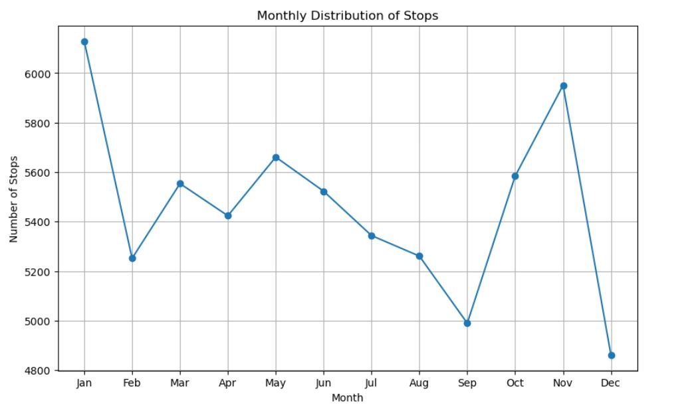

# Police Department Research Analysis

## Introduction

Welcome to the documentation for my Police Department Research Analysis project. In this project, i conduct an in-depth analysis of police stop data to gain insights into various aspects of law enforcement activities. By examining factors such as gender, age, race, and time of day, we aim to uncover patterns and trends that can inform policy decisions and improve policing practices.

## Research Questions

The project addresses the following key Research questions:

1. Were men or women stopped more often for speeding violations?
2. Does gender affect who gets searched during a police stop?
3. What is the mean duration of police stops?
4. How does the age distribution vary for different violations?
5. What is the demographic distribution of police stops by driver race?
6. How do the number of police stops vary by day of the week?
7. How do the number of police stops vary by month?
8. What is the distribution of police stops by time of day?

## Dataset Overview

### Description:
The dataset contains records of vehicle stops with various details such as date, time, driver information, violation details, search conducted, outcome of the stop, and whether it was related to drugs.
Each row represents a single vehicle stop incident.
The dataset provides insights into the demographics of drivers stopped, types of violations observed, frequency of searches conducted, and outcomes of the stops.

### Columns:
- stop_date: The date when the vehicle stop occurred.
- stop_time: The time when the vehicle stop occurred.
- country_name: The name of the country where the stop took place.
- driver_gender: The gender of the driver.
- driver_age_raw: The raw age of the driver as recorded during the stop.
- driver_age: The age of the driver.
- driver_race: The race of the driver.
- violation_raw: The raw description of the violation observed by the officer.
- violation: The specific type of violation.
- search_conducted: Indicates whether a search was conducted during the stop (True/False).
- search_type: The type of search conducted, if any.
- stop_outcome: The outcome of the stop.
- is_arrested: Indicates whether an arrest was made during the stop (True/False).
- stop_duration: The duration of the stop.
- drugs_related_stop: Indicates whether the stop was related to drugs (True/False).


## Data Cleaning and Transformation
In any data analysis project, ensuring the cleanliness and integrity of the dataset is crucial for obtaining accurate insights and making informed decisions. Data cleaning involves identifying and handling missing values, outliers, duplicates, and other inconsistencies in the dataset. Transformation, on the other hand, involves converting and restructuring the data to make it suitable for analysis. In this section, we'll walk through the data cleaning and transformation techniques applied to the dataset.

### Step 1: Removing Irrelevant Columns
The first step in data cleaning is to identify and remove any columns that are irrelevant or contain mostly null values. In this project, the country_name column was identified as completely null and was removed from the dataset using the following code:

```python
data.drop(columns='country_name', inplace=True)
```
### Step 2: Handling Missing Values
Missing values are common in datasets and need to be addressed before analysis. In this project, missing values were handled using various techniques:

- **Imputation of Median Age:** Missing values in the driver_age column were imputed with the median age of the dataset using the following code:
```python
median_age = data['driver_age'].median()
data['driver_age'].fillna(median_age, inplace=True)
```
- **Imputation of Mode for Categorical Columns:*** Missing values in categorical columns such as driver_gender, driver_race, violation_raw, violation, stop_outcome, and is_arrested were imputed with the most frequent category (mode) using a loop and the mode() function.
```python
mode_gender = data['driver_gender'].mode()[0]
data['driver_gender'].fillna(mode_gender, inplace=True)

# Loop for other categorical columns
categorical_columns = ['driver_race', 'violation_raw', 'violation', 'stop_outcome', 'is_arrested']
for column in categorical_columns:
    mode_value = data[column].mode()[0]
    data[column].fillna(mode_value, inplace=True)
```
- **Creating a New Category for Missing Values:** The search_type column, representing the type of search conducted, had missing values that were replaced with a new category 'Not Specified'.
```python
data['search_type'].fillna('Not Specified', inplace=True)
```

## Data Analysis and Insights

### 1. Were men or women stopped more often for speeding violations?
I analyzed the data to determine whether men or women were stopped more often for speeding violations.
```python
# get the data where violation = 'speeding' then groupby gender
speeding_counts = data[data.violation == 'Speeding'].driver_gender.value_counts()
speeding_counts

# Plotting a bar chart to visualize the speed violation by gender
plt.bar(speeding_counts.index, speeding_counts.values, color = ('skyblue', 'salmon'))
plt.title('Speeding Violations by Driver Gender')
plt.xlabel('Gender')
plt.ylabel('Count')
plt.show()
```


- **INSIGHTS:** The analysis reveals that men were stopped more frequently for police searches than women. Specifically, out of a total of 41,264 searches conducted, 29,578 men underwent searches, while only 11,686 women were subjected to them. This finding underscores a notable discrepancy, suggesting that a higher proportion of men were stopped for searches compared to women.

### 2. Does gender affect who gets searched during a police stop?

```python
# create a new dataframe where 'search_conducted' == 'True' 

search_conducted_true = data[data['search_conducted'] == True]
search_conducted_true

# group by gender to see the distribution

grouped_data = search_conducted_true.groupby('driver_gender')
search_counts = grouped_data.size()
search_counts

# Visualizing the search count according to gender
plt.bar(search_counts.index, search_counts.values, color=('skyblue', 'salmon'))
plt.title('Distribution of Searches Conducted by Driver Gender')
plt.xlabel('Gender')
plt.ylabel('Count')
plt.show()
```


- **INSIGHTS:** After looking at the search data based on driver gender, it's clear that there were a total of 2479 searches. Male drivers (M) were searched 2113 times, while female drivers (F) were searched only 366 times. This shows a significant difference, with male drivers being searched at a much higher rate.

### 3. What is the mean duration of police stops?

I analyzed the data to determine the average duration of police stops, a crucial metric in understanding the time spent during law enforcement interactions with individuals.
```python
# since we can't find the mean of the 'string_type', we covert to integers using the map.() function
# This way, each value in the 'stop_duration' column is mapped to its corresponding numeric value according to the dictionary provided.

data['stop_duration'] = data['stop_duration'].map({'0-15 Min': 7.5, '16-30 Min': 24, '30+ Min': 45})

#calculate the mean 

data['stop_duration'].mean()

MEAN DURATION OF POLICE STOPS = 11.9 min
```

- **INSIGHTS:** The reported insight regarding the mean stop duration reveals that, on average, police stops lasted approximately 11.9 minutes. This finding provides valuable insight into the typical duration of law enforcement interactions during traffic stops, offering a benchmark for evaluating efficiency and procedural fairness within policing practices.

### 4. How does the age distribution vary for different violations?

In this analysis, I investigate how violations vary across different age groups. By exploring the age distribution for various infractions, I aim to uncover insights that could inform targeted interventions and policy decisions.
```python
# Group the data by 'violation' and calculate descriptive statistics for 'driver_age'

age_distribution = data.groupby('violation').driver_age.describe()
age_distribution
```


- **INSIGHTS:** The age distribution varies across different violations, with equipment violations having a mean age of 31.68 years, moving violations at 36.71 years, other violations at 40.09 years, registration/plates violations at 32.65 years, seat belt violations at 30.33 years, and speeding violations at 33.04 years.

### 5. What is the demographic distribution of police stops by driver race?

In this analysis, I examined the demographic distribution of police stops based on driver race. This investigation provides insights into the representation of different racial groups among individuals subjected to police stops, shedding light on potential disparities and patterns within law enforcement interactions.

```python
# Analyze distribution of stops by driver race

race_counts = data['driver_race'].value_counts()
race_counts

# plotting the distribution of stops by driver race 

plt.figure(figsize=(10, 6))
sns.countplot(x='driver_race', data=data, order = data['driver_race'].value_counts().index)
plt.title('Distribution of Stops by Driver Race')
plt.xlabel('Driver Race')
plt.ylabel('Number of Stops')
plt.show()
```


- **INSIGHTS:** This analysis indicates that individuals identified as White comprise the largest demographic racial group among those subjected to police stops by race, with a count of 49,807. This is followed by Black racial groups at 8,267, Hispanic racial groups at 5,611, Asian racial groups at 1,639, and Other racial groups at 211. This distribution highlights the varying representation of different racial groups within law enforcement interactions.

### 6. How do the number of police stops vary by day of the week?

In this analysis, i explore the variation in the number of police stops across different days of the week. This examination aims to reveal patterns or trends in law enforcement activities over the course of the week, providing insights into the temporal dynamics of police stops.

```python
# Extract day of the week from stop_date where Monday = 0 and Sunday = 6

data['day_of_the_week'] = pd.to_datetime(data['stop_date']).dt.dayofweek
data.head()

# Extracting the most common day of the week with respect to stops
day_of_week_counts = data['day_of_the_week'].value_counts().sort_index()
print('\nNumber of stops by days:\n',day_of_week_counts)

# Plot day of the week distribution
plt.figure(figsize=(10, 6))
sns.lineplot(x=day_of_week_counts.index, y=day_of_week_counts.values, marker='o')

# Set custom tick labels for the day of the week
day_labels = ['Mon', 'Tue', 'Wed', 'Thu', 'Fri', 'Sat', 'Sun']
plt.xticks(range(7), day_labels)

plt.title('Distribution of Stops by Day of Week')
plt.xlabel('Day of Week')
plt.ylabel('Number of Stops')
plt.grid(True)
plt.show()
```


- **INSIGHTS:** On Mondays, law enforcement is at its busiest, with 9,637 recorded stops, indicating a peak in activity. However, Thursdays see a dip in law enforcement engagements, with only 9,041 stops, suggesting a quieter day compared to the rest of the week.

### 7. How do the number of police stops vary by month?

In this analysis, I explore how the number of police stops varies by month. By examining the monthly distribution of police stops, I aim to identify any seasonal patterns or trends that could provide valuable insights for law enforcement strategies and resource allocation.

```python
# Convert 'stop_date' column to datetime format
data['stop_date'] = pd.to_datetime(data['stop_date'])

# Create a new month column with abbrevations 
data['month_abbrev'] = data['stop_date'].dt.month_name().str[:3]

# Calculate monthly stops
monthly_stops = data['month_abbrev'].value_counts().sort_index()
monthly_stops

# Plot monthly distribution of stops using a line chart

plt.figure(figsize=(10, 4))
data['month_abbrev'].value_counts(sort=False).sort_index().plot(marker='o')

# Set custom tick labels for the day of the week
month_labels = ['Jan', 'Feb', 'Mar', 'Apr', 'May', 'Jun', 'Jul', 'Aug', 'Sep', 'Oct', 'Nov', 'Dec']
plt.xticks(range(1,13), month_labels)
plt.title('Distribution of Stops by Month')
plt.xlabel('Month')
plt.ylabel('Number of Stops')
plt.grid(True)
plt.show()
```


- **INSIGHTS:** 
The analysis of monthly stops reveals that January (6,129) records the highest number of police stops, indicating heightened law enforcement activity at the beginning of the year. Conversely, December (4,862) sees the lowest number of stops, potentially due to holiday season factors or other seasonal influences.

### 8. What is the distribution of police stops by time of day?
```python
# Extract the hour from the stop_time column

data['hour'] = pd.to_datetime(data['stop_time']).dt.hour
data

#categorizing the hour column into time of the day
def categorize_time(hour):
    if 0 <= hour < 4:
        return 'Late Night'
    elif 4 <= hour < 8:
        return 'Early Morning'
    elif 8 <= hour < 12:
        return 'Morning'
    elif 12 <= hour < 16:
        return 'Afternoon'
    elif 16 <= hour < 20:
        return 'Evening'
    else:
        return 'Night'
# apply categorization function to create new column
data['time_of_day'] = data['hour'].apply(categorize_time)
data

# Time of day data
time_of_day_counts = {
    'Early Morning': 6137,
    'Morning': 17903,
    'Afternoon': 13491,
    'Evening': 8263,
    'Night': 9711,
    'Late Night': 10030
}

# Plot distribution of stops by time of day using a line chart
plt.figure(figsize=(10, 4))
plt.plot(time_of_day_counts.keys(), time_of_day_counts.values(), marker='o')

# Set custom tick labels for the time of day
time_of_day_labels = ['Early Morning', 'Morning', 'Afternoon', 'Evening', 'Night', 'Late Night']
plt.xticks(range(len(time_of_day_labels)), time_of_day_labels, rotation=45)

plt.title('Distribution of Stops by Time Of Day')
plt.xlabel('Time of the Day')
plt.ylabel('Number of Stops')
plt.grid(True)
plt.show()
```


## Conclusion

In conclusion, this Police Department Research Analysis project provides valuable insights into various aspects of law enforcement activities. By examining factors such as gender, age, race, and time of day, we have gained a deeper understanding of policing practices and identified areas for further investigation and improvement.

---
## Recommendations
Based on our analysis, we offer the following recommendations to enhance policing practices and improve the effectiveness of law enforcement efforts:

**- Diversify Training Programs:** Given the disparities observed in the frequency of police stops by gender and race, it is essential to implement training programs that promote cultural sensitivity and bias awareness among law enforcement officers. These programs can help mitigate potential biases and ensure fair treatment of all individuals during police interactions.

**- Enhance Data Collection and Reporting:** Police departments should prioritize the collection and reporting of comprehensive data on police stops, including demographic information of individuals stopped, reasons for stops, and outcomes of searches. By enhancing data collection practices, agencies can better monitor and analyze policing activities to identify potential areas of improvement and address disparities in law enforcement practices.

**- Community Engagement and Outreach:** Establishing open lines of communication and fostering trust between law enforcement agencies and the communities they serve is crucial for effective policing. Police departments should engage in community outreach initiatives, such as town hall meetings, neighborhood patrols, and youth mentorship programs, to build positive relationships and address community concerns.

**- Implement Accountability Measures:** To ensure transparency and accountability in policing practices, agencies should implement mechanisms for monitoring and evaluating officer conduct, including regular performance evaluations, independent oversight committees, and civilian review boards. These measures can help identify and address instances of misconduct or excessive use of force, promoting public trust and confidence in law enforcement.

**- Invest in Technology and Data Analytics:** Leveraging technology and data analytics tools can enhance the efficiency and effectiveness of policing operations. Police departments should invest in advanced analytics platforms, such as predictive policing software and real-time crime mapping systems, to identify crime hotspots, allocate resources more effectively, and proactively address emerging threats to public safety.

By implementing these recommendations, police departments can strive to uphold the principles of fairness, accountability, and community-centered policing, fostering safer and more inclusive communities for all individuals.
